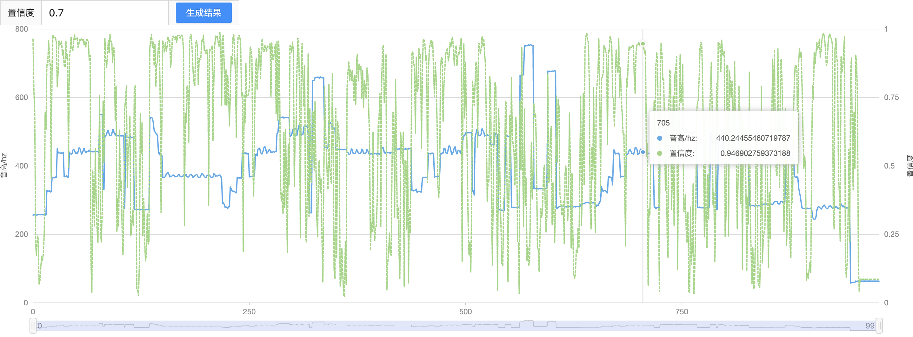
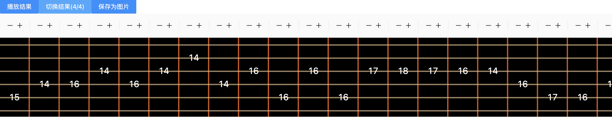

# pitch-detect

a pitch-detect tools using tensorflow.js built with react

# Quick start
npm i 

npm run dev

### line chart and spectral chart

### result supports playing, editing and saving as picture

# Credits

This demo could not have been done without the following:

* [TensorFlow.js](https://tensorflow.google.cn/js/tutorials).
* [Magenta repository spice model](https://github.com/tensorflow/magenta-js#readme).
* [antd](https://ant.design/docs/react/introduce-cn).
* [ahooks](https://ahooks.gitee.io/zh-CN/guide).
* [tone.js](https://www.npmjs.com/package/tone).
* [html2canvas](https://www.npmjs.com/package/html2canvas).

# TODO
use [spleeter model](https://github.com/deezer/spleeter) to seperate drums and solo
