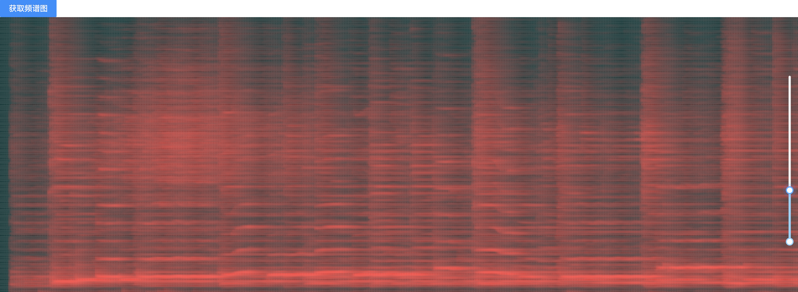

# 音高预测

使用tensorflow.js的模型检测音高工具

# 运行方法
npm i 

npm run dev

### 提供了预测结果折线图和频谱图供参照

### 结果支持修改和保存

# 致谢

* [TensorFlow.js](https://tensorflow.google.cn/js/tutorials).
* [Magenta repository spice model](https://github.com/tensorflow/magenta-js#readme).
* [antd](https://ant.design/docs/react/introduce-cn).
* [ahooks](https://ahooks.gitee.io/zh-CN/guide).
* [tone.js](https://www.npmjs.com/package/tone).
* [html2canvas](https://www.npmjs.com/package/html2canvas).

# 待添加
使用[spleeter模型](https://github.com/deezer/spleeter)分离鼓和solo
